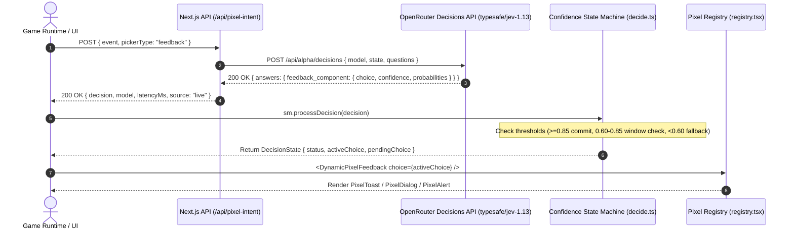

# Jev Decision Layer & Dynamic Pixel UI Selection

The **Jev Decision Layer** brings TypeSafe AI's "Jev" System One decision model to JUI, dynamically selecting the optimal pixel UI component for any game event instead of relying on hardcoded `if/switch` statements.

---

## 1. Model & Engine Specifications

- **Model ID**: `typesafe/jev-1.13` (pinned version) / `typesafe/jev-latest`
- **Provider**: TypeSafe AI
- **Gateway**: OpenRouter Decisions API
- **Endpoint**: `POST https://openrouter.ai/api/alpha/decisions`
- **Architecture**: Non-autoregressive System One classification model returning calibrated probability distributions over fixed option sets in under 100–500ms without free-text streaming.

---

## 2. Integrated Components

The primary integration is the **Feedback Component Picker**, mapping game event signals to three concrete JUI pixel primitives:

| Component | Decision Key | Visual Role | Player Interruption | Typical Urgency |
| :--- | :--- | :--- | :--- | :--- |
| **`PixelToast`** | `"toast"` | Ambient auto-dismissing banner | None (auto-dismisses after 5s) | `low` |
| **`PixelAlert`** | `"alert"` | Persistent tactical warning banner | Non-blocking inline banner | `medium` / `high` |
| **`PixelDialog`** | `"dialog"` | Blocking modal dialogue with action footer | Interrupts input until acknowledged | `critical` / milestones |

### Dynamic Renderer: `<DynamicPixelFeedback />`

Exported from `components/pixel/registry.tsx`:
```tsx
import { DynamicPixelFeedback } from "@/components/pixel/registry";

<DynamicPixelFeedback
  choice={decisionState.activeChoice}
  event={gameEvent}
  isPending={decisionState.status === "pending"}
  onDismiss={() => handleDismiss()}
  onConfirm={() => handleConfirm()}
/>
```
- **Ghost State**: When a decision is `pending` (under confidence-smoothing verification), the component renders with 60% opacity, subtle desaturation, and a pulsing `CONFIRMING INTENT...` pixel badge to prevent abrupt UI pop-in.

### Additional Schemas (Defined in `lib/jev/pixelUIQuestions.ts`):
- **Progress Picker**: Dynamically selects between `HealthBar` (vital pool depletion), `PixelProgressBar` (accumulating progress), and `PixelBadge` (discrete counts).
- **Interaction Picker**: Dynamically selects between `InventoryGrid` (slot management), `PixelDialog` (story dialogues), and `PixelPanel` (static menu codex).

---

## 3. Real-World Use Cases & Scenarios

| Event Title & Message | Model Decision | Why Jev Picked It | Rendered UI |
| :--- | :--- | :--- | :--- |
| **"Iron Dagger Found"**<br>`+2 ATK dagger added to backpack.` | `toast` (100% conf) | Non-disruptive loot gain; player is actively exploring. | Floating auto-dismissing `PixelToast` at corner |
| **"Toxic Spores Inhaled"**<br>`Poisoned! -5 HP/sec for 10s.` | `alert` (100% conf) | Tactical combat threat; player must stay alert but retain keyboard controls. | High-visibility amber/red `PixelAlert` banner |
| **"Dragon Lord Vanquished"**<br>`Ancient Wyrm has fallen. Portal unlocked.` | `dialog` (99% conf) | Major gameplay milestone requiring explicit player pause & acknowledgment. | Modal `PixelDialog` with `[ ENTER ] Continue` button |
| **"Vague Cave Murmur"**<br>`Faint breeze through damp rocks.` | `toast` (safe fallback) | Low confidence (< 0.60) ambient signal safely routed to non-intrusive toast. | Ambient low-contrast `PixelToast` |

---

## 4. End-to-End Architecture & Response Lifecycle



### Step 1: Client Request (`POST /api/pixel-intent`)

```json
{
  "event": {
    "type": "hazard_damage",
    "title": "Toxic Spores Inhaled",
    "message": "Poisoned! -5 HP/sec for 10 seconds. Antidote required.",
    "urgency": "high"
  },
  "pickerType": "feedback"
}
```

### Step 2: OpenRouter Jev Model Call

The server route formats the event into an unconstrained natural state prompt and queries `typesafe/jev-1.13`:

```json
{
  "model": "typesafe/jev-1.13",
  "state": "GAME EVENT EVALUATION:\n- Event Type: hazard_damage\n- Title: Toxic Spores Inhaled\n- Urgency: high\n- Message: Poisoned! -5 HP/sec for 10 seconds. Antidote required.",
  "questions": {
    "feedback_component_picker": {
      "type": "choice",
      "instructions": "Evaluate the game event signals. Choose whether to display an ambient transient Toast, a modal Dialog requiring player confirmation, or a persistent tactical Alert panel.",
      "criteria": {
        "toast": "PixelToast: Ambient, transient, non-blocking notification...",
        "dialog": "DialogBox: Urgent, blocking modal dialog that interrupts gameplay...",
        "alert": "PixelAlert: Persistent or high-visibility inline warning banner for ongoing tactical hazards..."
      }
    }
  }
}
```

### Step 3: OpenRouter Jev Decision Response

Jev calculates calibrated probabilities across the choice set:

```json
{
  "model": "typesafe/jev-1.13-20260917",
  "answers": {
    "feedback_component_picker": {
      "type": "choice",
      "choice": "alert",
      "probabilities": {
        "toast": 0.0,
        "dialog": 0.0,
        "alert": 1.0
      },
      "confidence": 1.0
    }
  },
  "usage": {
    "input_tokens": 364,
    "output_tokens": 39,
    "cost": 0.000015288
  },
  "latency": 348
}
```

### Step 4: Confidence-Smoothing State Machine (`lib/decide.ts`)

To avoid flickering during rapid events or micro-uncertainty, `useDecisionSmoothing` applies three rules:

1. **High Confidence ($\ge 0.85$)**: Immediately commits the choice to `activeChoice`. Status = `committed`.
2. **Moderate Confidence ($0.60 \le c < 0.85$)**:
   - First hit: Enters `pending` status. Retains the previous component while staging `pendingChoice` with ghost state styling.
   - Second hit within $1200\text{ms}$ window: Confirms and commits to `activeChoice`.
3. **Low Confidence ($< 0.60$)**:
   - Immediately falls back to safe default (`PixelToast`) to avoid trapping user focus with an accidental modal.
4. **No Random Fallback**: If the API call fails or the model returns an error, the system returns an explicit HTTP 502 with the real error message instead of generating fake random decisions.

---

## 5. Usage in React Components

```tsx
import React, { useState } from "react";
import { useDecisionSmoothing } from "@/lib/decide";
import { DynamicPixelFeedback } from "@/components/pixel/registry";
import { GameEvent, FeedbackChoice } from "@/lib/jev/pixelUIQuestions";

export function CombatFeedbackWidget() {
  const { state, processDecision, reset } = useDecisionSmoothing<FeedbackChoice>({
    safeDefault: "toast",
    highConfidenceThreshold: 0.85,
    lowConfidenceThreshold: 0.60,
    windowMs: 1200,
  });

  const [currentEvent, setCurrentEvent] = useState<GameEvent | null>(null);

  const handleGameEvent = async (event: GameEvent) => {
    setCurrentEvent(event);
    const res = await fetch("/api/pixel-intent", {
      method: "POST",
      headers: { "Content-Type": "application/json" },
      body: JSON.stringify({ event, pickerType: "feedback" }),
    });

    if (res.ok) {
      const data = await res.json();
      processDecision(data.decision);
    }
  };

  return (
    <div>
      {currentEvent && (
        <DynamicPixelFeedback
          choice={state.activeChoice}
          event={currentEvent}
          isPending={state.status === "pending"}
          onDismiss={() => setCurrentEvent(null)}
          onConfirm={() => setCurrentEvent(null)}
        />
      )}
    </div>
  );
}
```

---

## 6. Interactive Playground & Telemetry
 
Run the development server and visit the documentation:
**`http://localhost:3000/docs#ai-decision-layer`** or the interactive showcase at **`http://localhost:3000/#showcase`**

Features included in the `PixelJevFeedback` drop-in primitive:
- **Scenario Triggers**: Minor Loot, Hazard/Poison, Boss Defeat, Ambiguous Whisper.
- **Live Telemetry & Inspector**: Real-time confidence gauge, model latency, live source badge, and model decision rationale.
- **Adaptive Render**: Dynamically renders `PixelToast`, `PixelAlert`, or `PixelDialog` based on real-time event signals.
